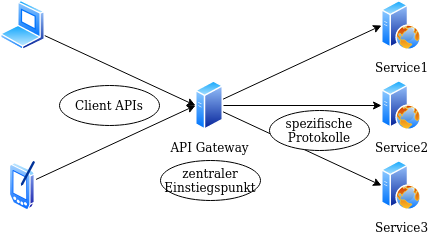

### Was ist ein Gateway?

ein Knoten, der als Einstiegspunkt in ein anderes Netzwerk mit anderen Kommunikationsprotokoll dient

<-->

### Was ist ein API-Gateway?

<-->

### Was ist Spring Cloud Gateway?

* API-Gateway auf Basis des Spring Ökosystems

* Funktionsumfang:
  * Routing
  * zentrale Security, Monitoring, Resilienz

<-->

### Wie ist Spring Cloud Gateway aufgebaut?

* Basis: Spring WebFlux und Project Reactor

* Runtime: Netty

<--->

### Wie funktioniert Spring Cloud Gateway?

##### (c) https://docs.spring.io/spring-cloud-gateway/docs/2.2.5.RELEASE/reference/html/#gateway-how-it-works

<-->

### Wie wird es konfiguriert?

YAML:

<pre><code data-trim data-noescape>
spring:
  cloud:
    gateway:
      routes:
      - id: rewritepath_route
        uri: https://example.org
        predicates:
        - Path=/sample/**
        filters:
        - RewritePath=/sample(?<segment>/?.*), $\{segment}
</code></pre>

<-->

### Wie wird es konfiguriert?

FluentAPI in Code:

<pre><code data-trim data-noescape>
@Bean
public RouteLocator customRouteLocator(RouteLocatorBuilder builder) {
    return builder.routes()
            .route(r -> r.host("**.abc.org").and().path("/sample")
                .filters(f ->
                        f.addResponseHeader("X-TestHeader", "foobar"))
                .uri("https://example.org")
            )
            .build();
}
</code></pre>

<--->

### Was beinhaltet Spring Cloud Gateway?

* Route Predicate Factories: Matching von Routen

* Gateway Filters: Filter für eine Route

* Global Filters: Filter für alle Routen

* CORS Konfiguration

* Actuator API: Lesen, Erstellen und Löschen von Routen